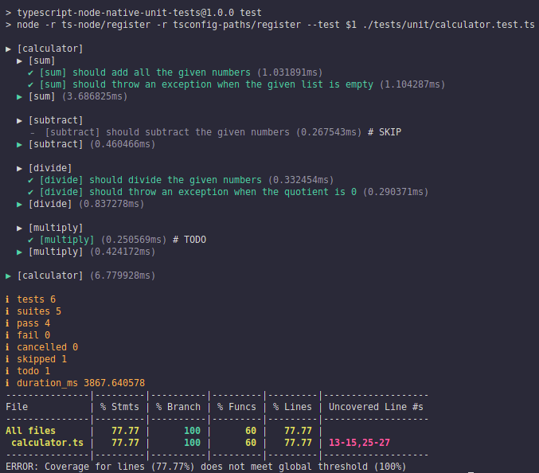

<h1 align="center">Typescript Node Native Unit Tests</h1>

Repository with examples of unit tests using NodeJS native features

**Configuration**
Run the following command to add the required libraries to run the code.

``` bash
npm install
```

**Running**
Run the following command to run the Unit Tests.

``` bash
npm run test:unit
```

It will generate a coverage/ folder and it will print on the Console the following output.



**Documentation**
- [c8 - NPM](https://www.npmjs.com/package/c8#checking-for-full-source-coverage-using---all)
- [Article - Medium](https://medium.com/@dev_bo/desvendando-o-futuro-test-runner-integrado-no-node-js-e-como-aplicar-em-arquivos-typescript-ba7b9083f04a)
